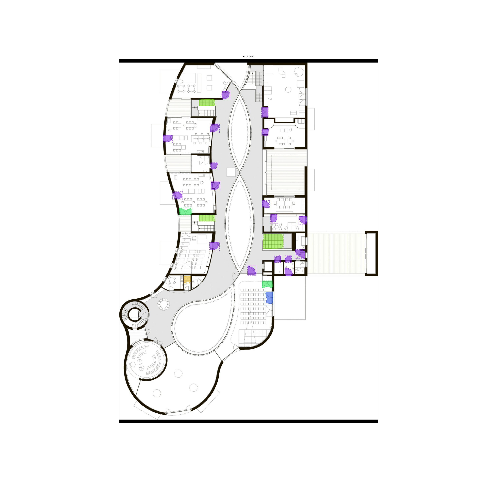

# Deep Learning (DL) Models for Floor Plan Image Analysis

This repo demonstrates several approaches to floor plan image analysis. Each approach contains three Models. In this document, the School-Floorplans approach is outlined. All models mentioned in the following have varying configurations and use all layers during training.

DICTA Paper Link: TBC soon

## Getting Started:
- Clone the repo and run ```cd floorplans_analyser```
- Install python version 3.6
    - You may create a new conda environment for python3.6
    ```
    conda create -n floorplan-mrcnn python=3.6
    conda activate floorplan-mrcnn
    ```
  - Clone the repo and run "pip install -r requirements.txt"
  - Install Jupyter Notebook "pip install ipython"
  
# 1. Mask-RCNN Floor Plan Image Analysis DL model using Keras and TensorFlow
This model generates bounding boxes and segmentation masks for 11 different floor plan layout elements including: Bathroom, Bathroom Stall, Door (Curve), Door (Double), Door (Extending), Door (Line), Door (Revolving), Entrance, Lift, Meeting Room, Stairs 

## 1.1 Model Performance Visualisation and Evaluation 

    ```
    cd notebooks
    jupyter notebook
    ```
    

### Floor plan Dataset:
The floor plan dataset was collated using various images from the internet.
[VGG Image Annotator (VIA)](https://www.robots.ox.ac.uk/~vgg/software/via/) tool is used for annotation. The tool runs in a web browser and does not require any installation or setup. Polygons, rectangles and circles are manually annotated for the 11 layout elements in each of the 154 floor plan images. We used the tool to generate one single JSON file for the training set annotations and another JSON file for the annotations of the validation set. 
Annotated dataset can be downloaded from [here](https://drive.google.com/drive/folders/1etUvhgnKAgmJ7YaXZ7rj6qHnzPTVX_z9?usp=sharing) (Copy the downloaded folder to the dataset folder).

Three primary models have been trained to showcase the performance of the Mask R-CNN architecture under specific configurations.

### Annotated image for image 116 from the School Dataset:


### Floor plan detection results for image 116 from the School Dataset
#### Model 1

#### Model 2

#### Model 3

#### Fusion OR 

#### Fusion AND

### Quantitative Results for the Test Set:
For each model, three images in the test set are reported with the number of ground truth objects, the number of correct matches at IoU=0.7, the number of incorrect matches, the number of missing matches and the average precision. 
| Model | Image	| Width	| Height	| Objects Count	| Average Precision | Correct Matches | Incorrect Matches	| Missing Matches |
| :---- | :---- | :----: | :----: |:----:   |  :----: |  :----: |   :----: |:----: |
| 1 | sch_using_112.jpg |2019	|1639	|25	|0.928	|24	|2	|1|
| 2 | sch_using_112.jpg |2019	|1639	|25	|0.995	|25	|1	|0|
| 3 | sch_using_112.jpg |2019	|1639	|25	|1.000	|25	|0	|0|
| 1 | sch_using_115.jpg |5100	|3300	|40	|0.558	|28	|9	|12|
| 2 | sch_using_115.jpg |5100	|3300	|40	|0.607	|29	|8	|11|
| 3 | sch_using_115.jpg |5100	|3300	|40	|0.519	|27	|9	|13|
| 1 | sch_using_119.jpg |2280	|1417	|56	|0.571	|36	|23	|20|
| 2 | sch_using_119.jpg |2280	|1417	|56	|0.552	|34	|19	|22|
| 3 | sch_using_119.jpg |2280	|1417	|56	|0.378	|28	|30	|28|

## 1.2 Model Training: 
To generate the floorplan-mrcnn models, we complete three instances of training on varying configurations.

Floorplan-mrcnn trained models can be downloaded from [here](https://drive.google.com/drive/folders/1A-mxLk3-vJeZswecqJdWhFmzN7_q0P-6?usp=sharing)
COCO weights can be downloaded from [here](https://github.com/matterport/Mask_RCNN/releases/download/v1.0/mask_rcnn_coco.h5)

### Run the following commands to reproduce the trained model: 

#### Model 1 Training (model name: mask_rcnn_floorplan_i6_final_1.h5):
- Set the fields within floorplan.py to correspond to the following configuration
  ```
  MIN_SCALE = 0
  MIN_DIM = 2048
  MAX_DIM = 2048
  LOSS_WEIGHTS = (2, 1, 1, 1, 0.3)
  BACKBONE = "rn101"
  [PRESET] EPOCHS = 200
  [PRESET] LR = 0.001
  ```
  
- Download COCO weights (please see above links)

- Go to scripts folder
  ```
  cd "scripts"
  ```

- In Python
  ```
  import floorplan

  train(train_mode="full", gpu_count=1, weights_path="models/mask_rcnn_coco.h5", dataset_dir="./dataset/school_floor_plans", log_dir="../log/floorplan/")
  ```

#### Model 2 Training (model name: mask_rcnn_floorplan_i6_final_2.h5):
- Set the fields within floorplan.py to correspond to the following configuration
  ```
  MIN_SCALE = 02
  MIN_DIM = 2048
  MAX_DIM = 2048
  LOSS_WEIGHTS = (1, 1, 1, 1, 1)
  BACKBONE = "rn101"
  [PRESET] EPOCHS = 200
  [PRESET] LR = 0.001
  ```

- Download COCO weights (please see above links)

- Go to scripts folder
  ```
  cd "scripts"
  ```

- In Python
  ```
  import floorplan.py

  train(train_mode="full", gpu_count=1, weights_path="models/mask_rcnn_coco.h5", dataset_dir="./dataset/school_floor_plans", log_dir="../log/floorplan/")
  ```

  #### Model 3 Training (model name: mask_rcnn_floorplan_i6_final_3.h5):
- Set the fields within Floorplan.py to correspond to the following configuration
  ```
  MIN_SCALE = 4
  MIN_DIM = 2048
  MAX_DIM = 2048
  LOSS_WEIGHTS = (2, 1, 1, 1, 0.3)
  BACKBONE = "rn101"
  [PRESET] EPOCHS = 200
  [PRESET] LR = 0.001
  ```

- Download COCO weights (please see above links)

- Go to scripts folder
  ```
  cd "scripts"
  ```

- In Python
  ```
  import floorplan.py

  train(train_mode="full", gpu_count=1, weights_path="models/mask_rcnn_coco.h5", dataset_dir="./dataset/school_floor_plans", log_dir="../log/floorplan/")
  ```
